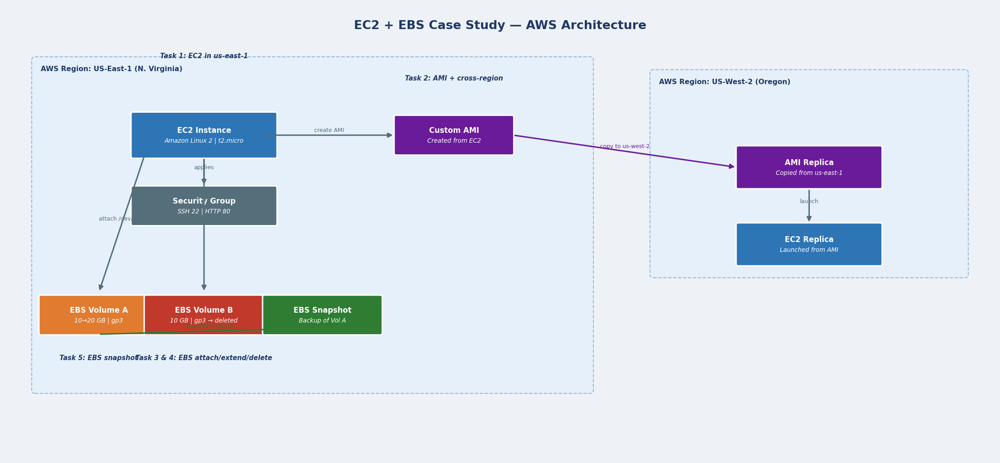

# EC2 + EBS Case Study — AWS Assignment



## Problem Statement

XYZ Corporation needs secured web servers on Linux to launch their application. The requirement includes cross-region instance replication, EBS volume management, and backup via snapshots.

## Tasks Completed

| Task | Description |
|---|---|
| Task 1 | EC2 instance launched in US-East-1 with Amazon Linux 2 and Apache web server |
| Task 2 | AMI created from instance and replicated to US-West-2; new instance launched from replica AMI |
| Task 3 | Two EBS volumes (gp3, encrypted) created and attached to the US-East-1 instance |
| Task 4 | Volume B detached and deleted; Volume A extended from 10 GB to 20 GB |
| Task 5 | EBS snapshot taken of Volume A as a backup |

## Repository Structure

```
01-ec2-ebs-case-study/
├── architecture-diagram.png       # Full system architecture
├── aws-cli-reference.sh           # Step-by-step AWS CLI commands
├── terraform/
│   ├── main.tf                    # All AWS resources defined
│   ├── variables.tf
│   └── outputs.tf
└── scripts/
    ├── bootstrap-webserver.sh     # Apache install on EC2 (user-data)
    └── ebs-volume-management.sh   # Task 4: detach, delete, extend
```

## How to Run

### Using Terraform
```bash
cd terraform
terraform init
terraform plan  -var="key_pair_name=your-key"
terraform apply -var="key_pair_name=your-key"
```

### Task 4 — Volume management (after apply)
```bash
chmod +x scripts/ebs-volume-management.sh
./scripts/ebs-volume-management.sh <INSTANCE_ID> <VOLUME_A_ID> <VOLUME_B_ID>
```

### Verify web server
```bash
curl http://<EC2_PUBLIC_IP>
```

## Key Concepts Demonstrated

- **AMI management** — Creating a custom AMI from a running instance captures the OS and installed software as a reusable image
- **Cross-region replication** — AMI copy to us-west-2 enables disaster recovery and regional failover
- **EBS volume lifecycle** — Attach, extend (online resize), detach, and delete without instance downtime
- **EBS snapshots** — Point-in-time backups stored in S3; used for recovery and volume cloning
- **Encryption** — All EBS volumes and AMIs created with encryption enabled
