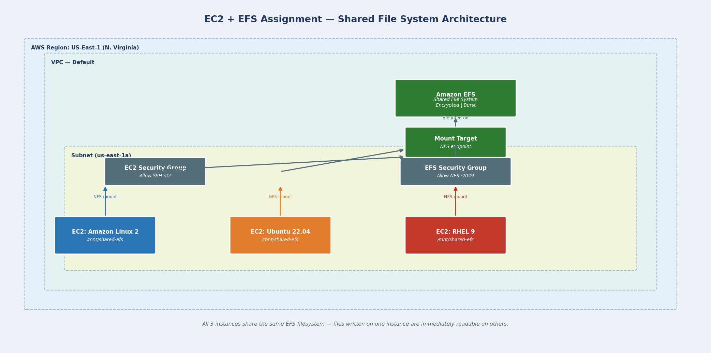

# EC2 + EFS Assignment — AWS Shared File System



## Problem Statement

Create an Amazon EFS file system and connect it to 3 EC2 instances running different operating systems (Amazon Linux 2, Ubuntu 22.04, Red Hat Enterprise Linux 9) — demonstrating that EFS provides a shared, cross-instance filesystem.

## Task Completed

| Task | Description |
|---|---|
| Task 1 | EFS created and mounted on 3 EC2 instances (Amazon Linux 2, Ubuntu 22.04, RHEL 9) via NFS |

## Repository Structure

```
02-ec2-efs-assignment/
├── architecture-diagram.png         # Full system architecture
├── aws-cli-reference.sh             # Step-by-step AWS CLI commands
├── terraform/
│   ├── main.tf                      # EFS + 3 EC2 instances + security groups
│   ├── variables.tf
│   └── outputs.tf
└── scripts/
    ├── mount-efs-amazon-linux.sh    # EFS mount for Amazon Linux 2
    ├── mount-efs-ubuntu.sh          # EFS mount for Ubuntu 22.04
    └── mount-efs-rhel.sh            # EFS mount for RHEL 9
```

## How to Run

```bash
cd terraform
terraform init
terraform plan  -var="key_pair_name=your-key"
terraform apply -var="key_pair_name=your-key"
```

## Verify Shared Filesystem

SSH into any instance and test that the filesystem is shared:

```bash
# On Amazon Linux instance — write a file
echo "written from Amazon Linux" > /mnt/shared-efs/test.txt

# On Ubuntu instance — read the same file
cat /mnt/shared-efs/test.txt
# Output: written from Amazon Linux

# Confirm mount on all instances
df -h /mnt/shared-efs
```

## Key Concepts Demonstrated

- **EFS vs EBS** — EBS is block storage attached to one instance; EFS is a managed NFS filesystem mountable by many instances simultaneously
- **Cross-OS compatibility** — EFS uses NFS protocol, which works on any Linux-based OS regardless of distribution
- **Security group chaining** — EFS security group allows NFS (port 2049) only from the EC2 security group — no direct public access
- **Persistent mount via /etc/fstab** — Mount survives instance reboots automatically
- **Encryption** — EFS created with encryption at rest enabled
