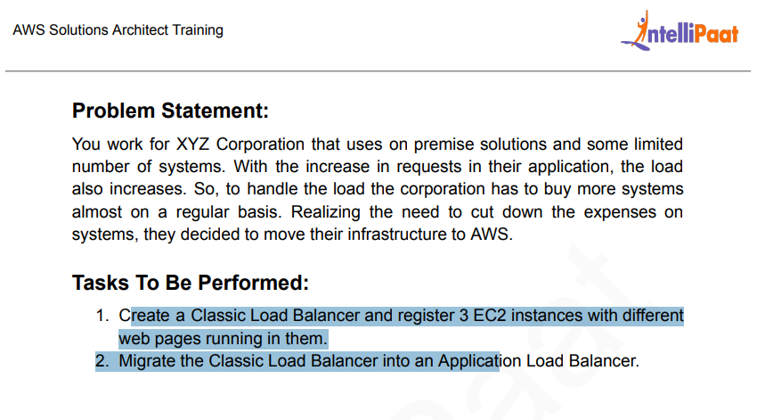
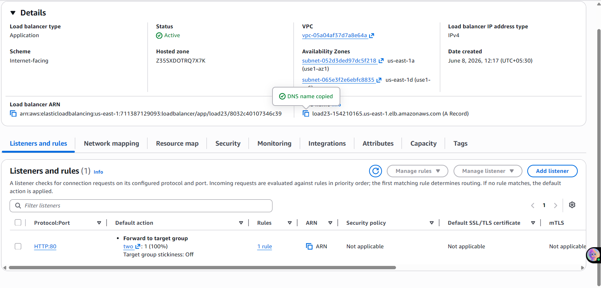
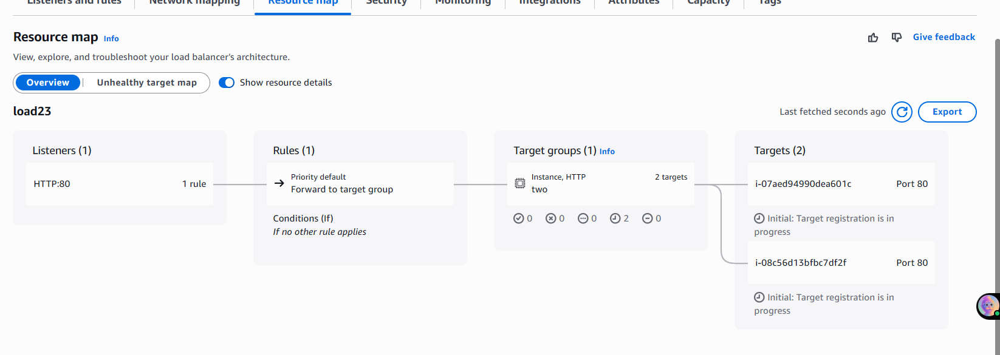
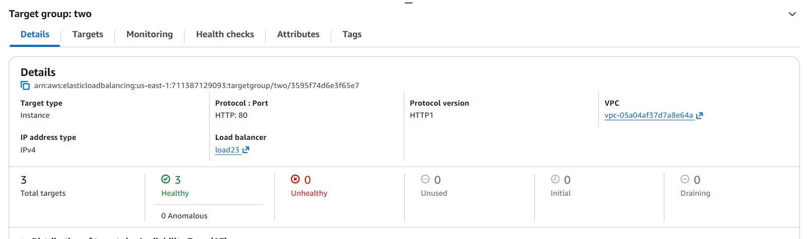
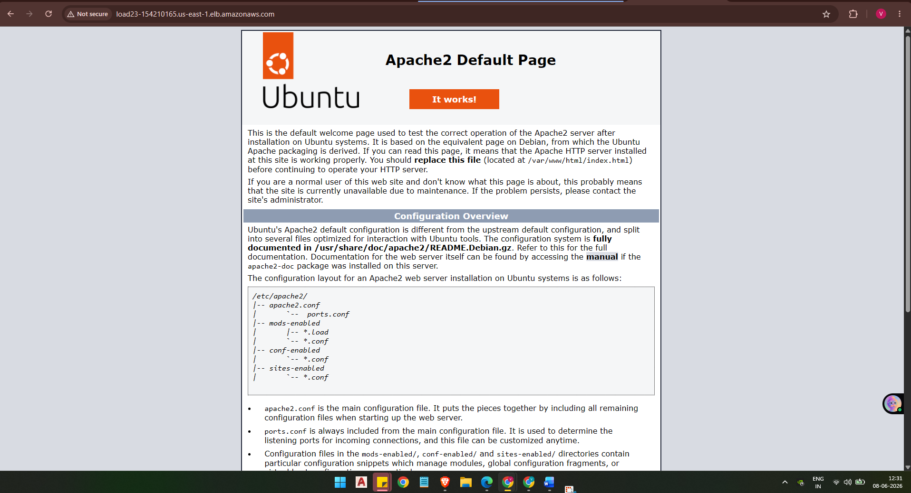

# AWS Application Load Balancer (ALB) – Distribute Traffic Across Multiple EC2 Instances

## Objective

Create an Application Load Balancer (ALB) that distributes incoming HTTP traffic across multiple EC2 instances running different web pages. Verify that the ALB correctly routes requests to each instance in a round-robin fashion.

---

## Problem Statement

> XYZ Corporation uses on-premise solutions with a limited number of systems. As application requests increase, the load also increases, forcing them to buy more servers regularly. To cut costs, they decided to move to AWS.
>
> **Tasks:**
> 1. Create a Classic Load Balancer and register 3 EC2 instances with different web pages running on them.
> 2. Migrate the Classic Load Balancer into an Application Load Balancer (ALB).

---

## Architecture Overview

```
               Internet
                  │
                  ▼
    ┌─────────────────────────┐
    │  Application Load       │
    │  Balancer (load23)      │
    │  HTTP:80 Listener       │
    │  Internet-facing, IPv4  │
    └────────────┬────────────┘
                 │ Forward to Target Group "two"
                 │
    ┌────────────┴─────────────┐
    │      Target Group        │
    │  (two) — HTTP:80         │
    │  3 Targets, 3 Healthy    │
    └──────┬──────────┬────────┘
           │          │
    ┌──────┴───┐  ┌───┴──────┐
    │ Server01 │  │ Server02 │  ...
    │ Apache2  │  │ Apache2  │
    │ (Ubuntu) │  │ (Ubuntu) │
    └──────────┘  └──────────┘

  Subnets: us-east-1a, us-east-1d | Same VPC
```

---

## Pre-requisites

- AWS account with EC2 and EC2 Load Balancing access
- 3 EC2 instances (Ubuntu) running in the **same VPC**, across **different subnets/AZs**
- Apache2 web server installed on each instance with a unique HTML page
- Security Group allowing **HTTP (port 80)** inbound on all EC2 instances
- Security Group allowing **HTTP (port 80)** inbound on the ALB

---

## Step-by-Step Setup

### Step 1 — Launch EC2 Instances

Launch 3 EC2 instances (Ubuntu) in the same VPC but across different subnets (different AZs for high availability).

### Step 2 — Install Apache and Create Unique Web Pages

Run the following on **each instance** (SSH into them one by one):

```bash
sudo apt update -y
sudo apt install apache2 -y
sudo systemctl start apache2
sudo systemctl enable apache2
```

**On Server 01** — set a unique page:
```bash
echo "HI this is server 01" | sudo tee /var/www/html/index.html
```

**On Server 02** — set a unique page:
```bash
echo "hello this is server 02" | sudo tee /var/www/html/index.html
```

**On Server 03** — set a unique page:
```bash
echo "hey this is server 03" | sudo tee /var/www/html/index.html
```

> Each instance serves a different page so we can visually confirm the ALB is routing to different targets.

---

### Step 3 — Create a Target Group

1. Go to **EC2 → Target Groups → Create Target Group**
2. Target type: **Instance**
3. Protocol: **HTTP**, Port: **80**
4. VPC: select your VPC
5. Health check: **HTTP**, path `/`
6. Register all 3 EC2 instances as targets
7. Name: `two`

---

### Step 4 — Create the Application Load Balancer

1. Go to **EC2 → Load Balancers → Create Load Balancer → Application Load Balancer**
2. Name: `load23`
3. Scheme: **Internet-facing**
4. IP address type: **IPv4**
5. Listeners: **HTTP:80**
6. Availability Zones: select **at least 2 subnets** (us-east-1a, us-east-1d)
7. Security Group: allow inbound **HTTP port 80**
8. Forward traffic to target group: **two**
9. Create the ALB — wait for status to become **Active**

---

### Step 5 — Verify Load Balancing

Copy the **ALB DNS name** from the console:
```
load23-154210165.us-east-1.elb.amazonaws.com
```

Open it in a browser and **refresh multiple times** — you will see different server responses, confirming traffic is being distributed across instances.

---

## Screenshots

### 1. Problem Statement


### 2. ALB Details — Active, HTTP:80 Listener, Forwarding to Target Group "two"


### 3. ALB Resource Map — Listener → Rule → Target Group → 2 Targets


### 4. Target Group "two" — 3 Targets, All Healthy


### 5. ALB DNS — Serving Server 01 Response


### 6. ALB DNS — Serving Server 02 Response (same URL, different server)


### 7. Apache2 Default Page via ALB DNS (Ubuntu instance)


---

## Key Learnings

- An **Application Load Balancer (ALB)** operates at **Layer 7 (HTTP/HTTPS)** — it can route based on URL path, hostname, headers, etc.
- The **Target Group** is the bridge between the ALB and EC2 instances — health checks run here to ensure only healthy instances receive traffic
- ALB requires **at least 2 subnets in different AZs** — this is mandatory for high availability
- Traffic is distributed in **round-robin** by default — refreshing the ALB DNS shows different server responses each time
- EC2 instances must have **port 80 open in their Security Group** AND the ALB Security Group must also allow **port 80 inbound**
- The ALB itself gets a **DNS name** (not an IP) — this is intentional, as ALB IPs can change; always use the DNS name

---

## ALB vs Classic Load Balancer

| Feature | Classic LB (CLB) | Application LB (ALB) |
|---------|-----------------|----------------------|
| OSI Layer | Layer 4 & 7 | Layer 7 only |
| Routing | Simple TCP/HTTP | Path-based, host-based, header-based |
| Target type | EC2 instances only | Instances, IPs, Lambda |
| Health checks | Basic TCP/HTTP | Advanced HTTP health checks |
| AWS recommendation | Legacy — not recommended | Preferred for HTTP/HTTPS workloads |

---

## Tools & Services Used

- AWS EC2 (Ubuntu instances)
- AWS Application Load Balancer (ALB)
- AWS Target Groups
- Apache2 web server
- Linux commands: `apt`, `systemctl`, `echo`, `tee`

---

*Assignment completed as part of AWS/DevOps hands-on training.*
