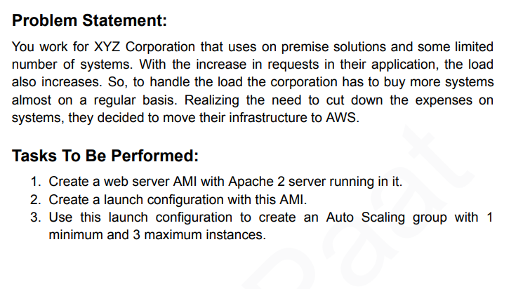
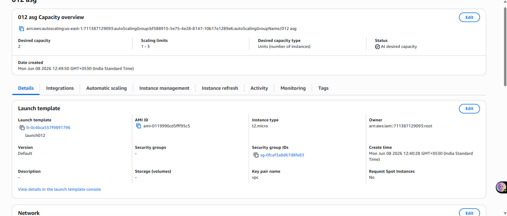
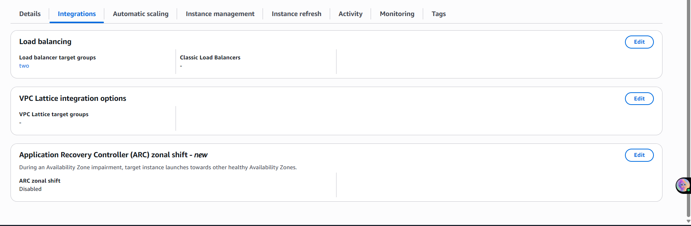
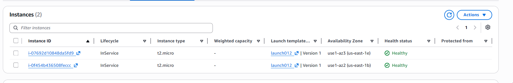
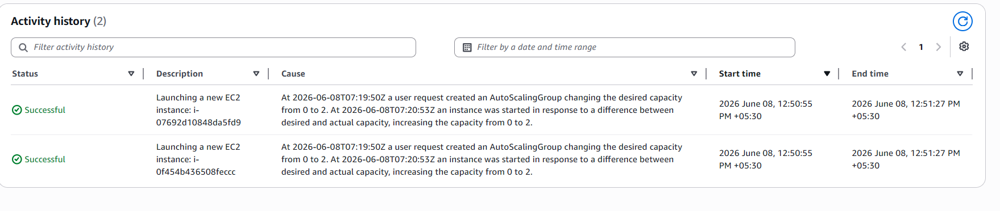
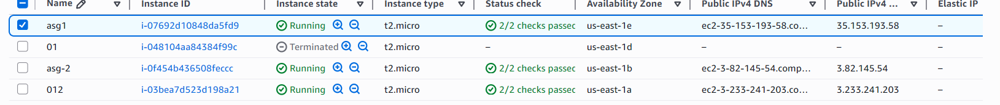

# AWS Auto Scaling Group (ASG) – Automatically Scale EC2 Instances with ALB Integration

## Objective

Create an Auto Scaling Group (ASG) using a Launch Template, configure minimum and maximum instance limits, and attach it to an Application Load Balancer. Verify that ASG automatically launches EC2 instances to meet the desired capacity.

---

## Problem Statement

> XYZ Corporation uses on-premise solutions and some limited number of systems. With the increase in requests in their application, the load also increases, forcing them to buy more servers regularly. To cut costs, they decided to move to AWS.
>
> **Tasks:**
> 1. Create a web server AMI with Apache2 server running in it.
> 2. Create a Launch Template with this AMI.
> 3. Use this Launch Template to create an Auto Scaling Group with **min 1** and **max 3** instances.

---

## Architecture Overview

```
               Internet
                  │
                  ▼
    ┌─────────────────────────┐
    │  Application Load       │
    │  Balancer (load23)      │
    │  HTTP:80                │
    └────────────┬────────────┘
                 │
    ┌────────────┴────────────┐
    │    Target Group "two"   │
    │    (managed by ASG)     │
    └────────────┬────────────┘
                 │
    ┌────────────┴────────────┐
    │   Auto Scaling Group    │
    │   "012 asg"             │
    │   Min: 1 | Max: 3       │
    │   Desired: 2            │
    └──────┬──────────┬───────┘
           │          │
    ┌──────┴───┐  ┌───┴──────┐
    │  asg1    │  │  asg-2   │
    │ t2.micro │  │ t2.micro │
    │us-east-1e│  │us-east-1b│
    │ Healthy  │  │ Healthy  │
    └──────────┘  └──────────┘

  Launch Template: launch012 | AMI: ami-0119990cd5fff95c5
```

---

## Pre-requisites

- A running EC2 instance with Apache2 installed (used to create the AMI)
- An existing Application Load Balancer and Target Group (from ALB assignment)
- EC2 key pair for SSH access
- Security Group allowing HTTP (port 80) inbound

---

## Step-by-Step Setup

### Step 1 — Create a Web Server AMI

First, launch an EC2 instance, install Apache2, then create a custom AMI from it:

```bash
# SSH into your base EC2 instance
sudo apt update -y
sudo apt install apache2 -y
sudo systemctl start apache2
sudo systemctl enable apache2

# Verify Apache is running
sudo systemctl status apache2
```

Then in the AWS Console:
1. Go to **EC2 → Instances** → select your instance
2. **Actions → Image and templates → Create image**
3. Name: e.g. `apache-web-server-ami`
4. Wait for the AMI status to become **Available**

---

### Step 2 — Create a Launch Template

1. Go to **EC2 → Launch Templates → Create Launch Template**
2. Name: `launch012`
3. AMI: select the AMI you just created (`ami-0119990cd5fff95c5`)
4. Instance type: `t2.micro`
5. Key pair: `vpc`
6. Security Group: select one with HTTP (port 80) open
7. Click **Create Launch Template**

> A Launch Template defines what every new instance launched by ASG will look like — OS, instance type, security groups, key pair, etc.

---

### Step 3 — Create the Auto Scaling Group

1. Go to **EC2 → Auto Scaling Groups → Create Auto Scaling Group**
2. Name: `012 asg`
3. Launch Template: `launch012` (Version: Default)
4. VPC and Subnets: select **multiple subnets across different AZs** (us-east-1a, us-east-1b, us-east-1e) for high availability
5. **Load Balancing**: attach to existing target group → `two`
6. Health check type: **ELB**
7. Configure group size:
   - Desired capacity: `2`
   - Minimum capacity: `1`
   - Maximum capacity: `3`
8. Scaling policies: keep as **None** (manual scaling for this assignment)
9. Review and **Create Auto Scaling Group**

---

### Step 4 — Verify ASG Launched Instances

After creation, go to the **Activity** tab of your ASG — you should see:

- 2 successful launch events (desired capacity was set to 2)
- ASG automatically launched instances across different AZs

Go to **EC2 → Instances** to confirm both `asg1` and `asg-2` are in **Running** state with **2/2 status checks passed**.

---

### Step 5 — Verify ALB Integration

Go to **ASG → Integrations tab** — confirm:
- Load balancer target group: **two**
- Both ASG-managed instances are registered and healthy in the target group

---

## Screenshots

### 1. Problem Statement


### 2. ASG Capacity Overview — Desired: 2, Min: 1, Max: 3, Launch Template: launch012


### 3. ASG Integrations — Attached to ALB Target Group "two"


### 4. ASG Instances — asg1 and asg-2, both Healthy across different AZs


### 5. Activity History — 2 Successful EC2 Launches by ASG


### 6. EC2 Console — ASG-managed instances Running alongside other instances


---

## Key Learnings

- An **Auto Scaling Group** automatically launches and terminates EC2 instances based on desired capacity and scaling policies
- A **Launch Template** defines the configuration for every new instance ASG spins up — AMI, instance type, key pair, security groups
- ASG should span **multiple subnets across different AZs** — if one AZ goes down, ASG launches replacement instances in a healthy AZ
- When attached to an ALB, ASG **automatically registers** new instances into the Target Group and **deregisters** terminated ones
- **Desired capacity** is the target number of instances ASG always tries to maintain — if an instance fails, ASG replaces it automatically
- The **min/max limits** act as guardrails: ASG will never go below min or above max regardless of scaling events
- ASG launched instances in `us-east-1b` and `us-east-1e` — two different AZs, demonstrating fault-tolerance

---

## ASG Key Concepts

| Term | Meaning |
|------|---------|
| Desired Capacity | Target number of running instances (ASG always tries to match this) |
| Minimum | ASG will never terminate below this count |
| Maximum | ASG will never launch above this count |
| Launch Template | Blueprint for new instances (AMI, type, SG, key pair) |
| Health Check | ASG terminates unhealthy instances and replaces them automatically |
| Scaling Policy | Rules that trigger scale-out or scale-in (CPU%, schedule, etc.) |

---

## How ASG + ALB Work Together

```
User Request
    │
    ▼
ALB (distributes traffic)
    │
    ▼
Target Group (tracks healthy instances)
    │
    ▼
ASG Instance 1 ──► If unhealthy, ASG auto-terminates + launches a new one
ASG Instance 2 ──► New instance auto-registers in Target Group via ASG
```

---

## Tools & Services Used

- AWS EC2 Auto Scaling Group
- AWS Launch Template
- AWS Application Load Balancer (ALB) + Target Group
- AWS EC2 (t2.micro, Ubuntu)
- Apache2 web server

---

*Assignment completed as part of AWS/DevOps hands-on training.*
