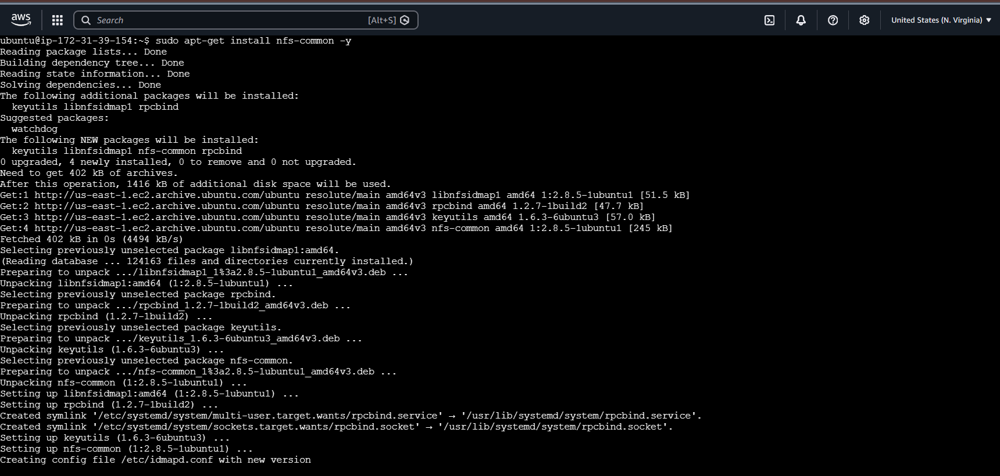
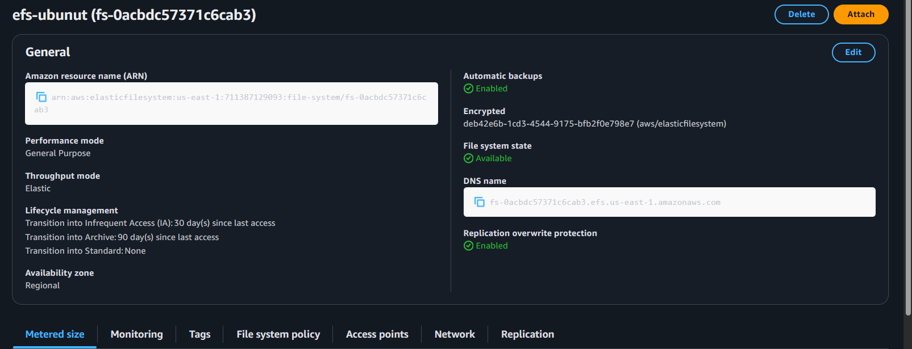
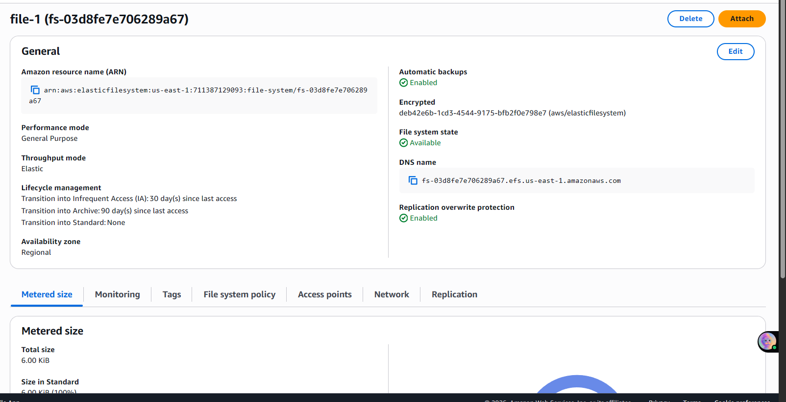
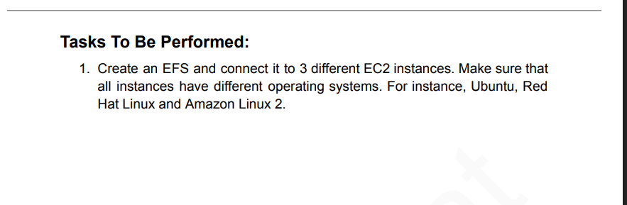

# AWS EFS – Mount EFS to Multiple EC2 Instances (Ubuntu & Amazon Linux 2)

## Objective

Create an AWS EFS (Elastic File System) and mount it to multiple EC2 instances running different operating systems (Ubuntu and Amazon Linux 2). Demonstrate that EFS is a shared, concurrent file system — files created on one instance are instantly visible on all others.

---

## Problem Statement

> Create an EFS and connect it to 3 different EC2 instances. Make sure that all instances have different operating systems — Ubuntu, Red Hat Linux, and Amazon Linux 2.

---

## Architecture Overview

```
          ┌──────────────────────────────────────┐
          │          AWS EFS (file-1)            │
          │  fs-03d8fe7e706289a67                │
          │  DNS: fs-03d8fe7e706289a67           │
          │       .efs.us-east-1.amazonaws.com   │
          └────────────┬─────────────────────────┘
                       │ NFS (port 2049)
          ┌────────────┴─────────────┐
          │                          │
   ┌──────┴──────┐           ┌───────┴──────┐
   │  Ubuntu EC2 │           │Amazon Linux 2│
   │  mount: efs1│           │  mount: efs2 │
   └─────────────┘           └──────────────┘

  Same VPC | Same AZ | Same Security Group (NFS port 2049 allowed)
```

---

## Pre-requisites

- AWS account with EC2 and EFS access
- EFS file system created in the same region (`us-east-1`)
- 2+ EC2 instances in the **same VPC, AZ, and Security Group**
- Security Group configured to allow **NFS traffic on port 2049** (inbound)
- EFS DNS name copied from the AWS Console

---

## AWS Console Steps

1. Go to **EFS → Create File System**
2. Choose your VPC, select the same AZ as your EC2 instances
3. Note the **DNS name** (e.g., `fs-03d8fe7e706289a67.efs.us-east-1.amazonaws.com`)
4. Under **Network**, ensure the mount target's Security Group allows port **2049 (NFS)**

---

## Setup: Ubuntu EC2 Instance

### Step 1 — Install NFS client
```bash
sudo apt-get install nfs-common -y
```
> Installs the NFS utilities required to mount EFS. Ubuntu does not have this by default.

### Step 2 — Create mount point
```bash
sudo mkdir efs1
```

### Step 3 — Mount EFS
```bash
sudo mount -t nfs4 -o nfsvers=4.1,rsize=1048576,wsize=1048576,hard,timeo=600,retrans=2,noresvport \
  fs-03d8fe7e706289a67.efs.us-east-1.amazonaws.com:/ efs1
```
> Mounts the EFS using NFSv4.1. Options set optimal read/write buffer sizes and connection resilience.

### Step 4 — Create files on Ubuntu
```bash
cd efs1
nano touch.txt
nano name.tx
ls
```
> Any file created here will be instantly visible on all other instances mounted to the same EFS.

---

## Setup: Amazon Linux 2 EC2 Instance

### Step 1 — Update packages
```bash
sudo yum update -y
```

### Step 2 — Create mount point
```bash
sudo mkdir efs2
```

### Step 3 — Mount the same EFS
```bash
sudo mount -t nfs4 -o nfsvers=4.1,rsize=1048576,wsize=1048576,hard,timeo=600,retrans=2,noresvport \
  fs-03d8fe7e706289a67.efs.us-east-1.amazonaws.com:/ efs2
```
> Same EFS DNS, same mount options — both instances now share the same file system.

### Step 4 — Verify shared files
```bash
cd efs2
ls
touch name.txt
sudo nano name.txt
ls
```
> Files created on Ubuntu (efs1) are immediately visible here (efs2) — confirming EFS shared storage works.

---

## Screenshots

### 1. Installing nfs-common on Ubuntu EC2


### 2. EFS File System — efs-ubuntu (AWS Console)


### 3. EFS File System — file-1 (DNS name visible)


### 4. Problem Statement


---

## Key Learnings

- EFS is a **managed NFS** — unlike EBS, it can be mounted on **multiple EC2 instances simultaneously**
- `nfs-common` must be installed on Ubuntu before mounting; Amazon Linux 2 has NFS support built in
- Both instances must be in the **same VPC, AZ, and Security Group** with **port 2049 (NFS)** open
- EFS is **truly shared** — a file written on one instance appears instantly on all others
- Mount is **not persistent** across reboots — add to `/etc/fstab` to make it permanent
- EFS **scales automatically** — no pre-provisioning of storage size required

---

## EBS vs EFS — Key Difference

| Feature | EBS | EFS |
|---------|-----|-----|
| Type | Block storage | Managed NFS (Network File System) |
| Concurrent access | One EC2 at a time | Multiple EC2 instances simultaneously |
| Formatting needed | Yes (`mkfs`) | No — mount directly |
| Mount command | `mount /dev/xvdf /data` | `mount -t nfs4 <efs-dns>:/ /mountpoint` |
| Storage scaling | Fixed (provisioned) | Elastic — auto scales |
| Use case | OS disk, databases | Shared files across multiple instances |

---

## Tools & Services Used

- AWS EFS (Elastic File System)
- AWS EC2 (Ubuntu 22.04 + Amazon Linux 2)
- NFS client (`nfs-common` on Ubuntu, built-in on Amazon Linux 2)
- Linux commands: `mkdir`, `mount`, `ls`, `touch`, `nano`, `yum`, `apt-get`

---

*Assignment completed as part of AWS/DevOps hands-on training.*
